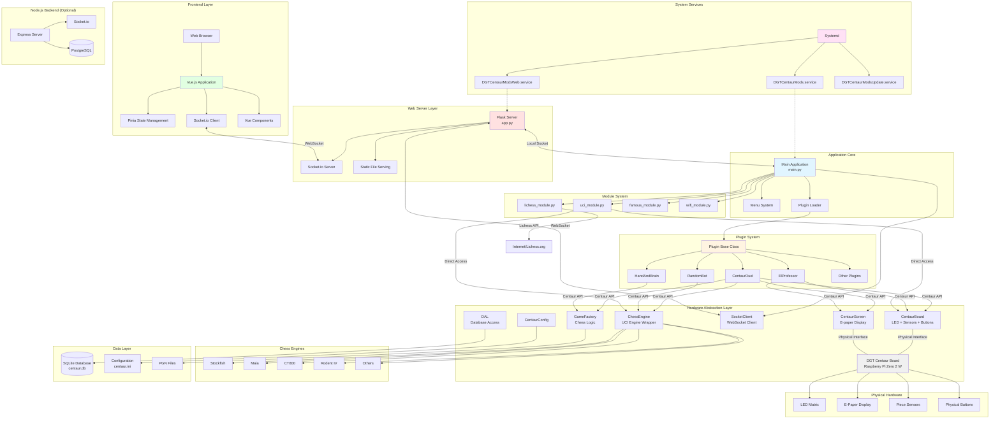
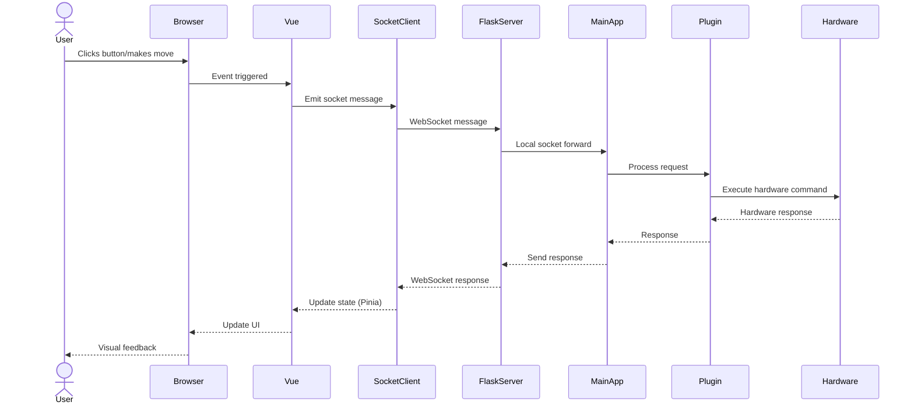
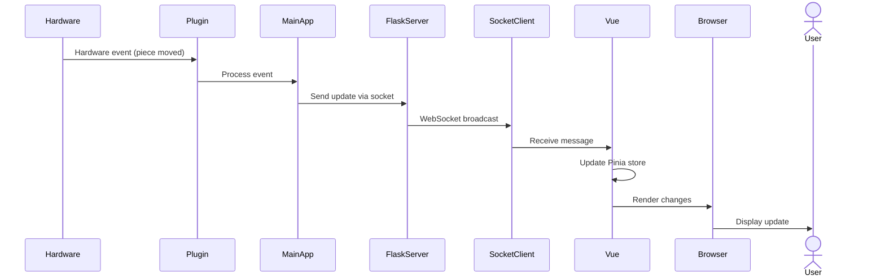
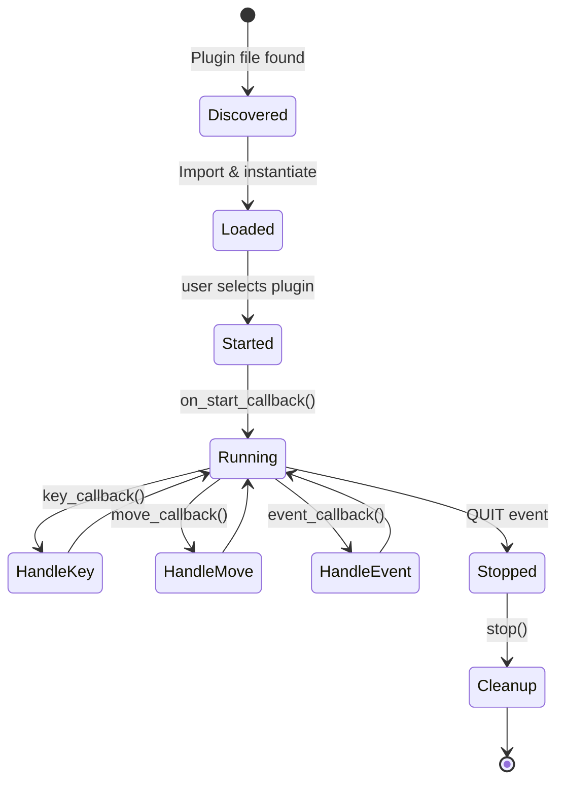

# DGT Centaur Mods Project Architecture

## Project Overview

DGT Centaur Mods is a comprehensive modification package for the DGT Centaur electronic chessboard. It replaces the standard firmware with an enhanced system that adds WiFi connectivity, web interface, plugin architecture, and integration with multiple chess engines. The software runs on a Raspberry Pi Zero 2 W inside the board and is distributed as a Debian package.

## Technology Stack

### Backend (Python)
- **Python 3.x**: Primary backend language
- **python-chess**: Chess logic and UCI protocol
- **Pillow (PIL)**: Image processing for e-paper display
- **Flask**: Web framework for REST API
- **flask-socketio**: Real-time WebSocket communication
- **berserk**: Lichess.org API client
- **wpa-pyfi**: WiFi configuration
- **SQLite**: Embedded database

### Alternative Backend (Node.js)
- **Node.js >=16**: JavaScript runtime
- **Express ^4.18.2**: Web framework
- **Socket.io ^4.7.2**: Bidirectional WebSockets
- **pg ^8.11.3**: PostgreSQL client

### Frontend (Vue.js)
- **Vue 3.3.8**: Progressive JavaScript framework
- **TypeScript 5.2.2**: Typed JavaScript superset
- **Vite 5.0.0**: Build tool and dev server

#### UI/UX
- **Tailwind CSS 3.3.5**: Utility-first CSS framework
- **DaisyUI 4.1.0**: UI components for Tailwind
- **@tailwindcss/typography 0.5.10**: Typography plugin

#### Chess & Gaming
- **@chrisoakman/chessboardjs 1.0.0**: Board visual rendering
- **chess.js 1.0.0-beta.6**: Client-side chess logic
- **jQuery 3.7.1**: Required by chessboardjs

#### State Management & Communication
- **Pinia 2.1.7**: Official state management for Vue 3
- **socket.io-client 4.7.2**: WebSocket client

#### Code Editor
- **CodeMirror 6.0.1**: Code editor
- **vue-codemirror 6.1.1**: Vue wrapper for CodeMirror
- **@codemirror/lang-python 6.1.3**: Python syntax support
- **@codemirror/language 6.9.2**: Language system
- **@codemirror/legacy-modes 6.3.3**: Additional modes

#### UI Components & Icons
- **@heroicons/vue 2.0.18**: SVG icons

#### Development Tools
- **@vitejs/plugin-vue 4.5.0**: Official Vue plugin for Vite
- **vue-tsc 1.8.22**: TypeScript type checker for Vue
- **Prettier 3.1.0**: Code formatter
- **Autoprefixer 10.4.16**: PostCSS plugin
- **PostCSS 8.4.31**: CSS processor

### Chess Engines (UCI)
- **Stockfish**: Strongest open-source chess engine
- **Maia**: AI-based engine that plays like humans
- **CT800**: Compact chess engine
- **Rodent IV**: Engine with adjustable personality
- **Galjoen**: Dutch chess engine
- **Texel**: Swedish chess engine
- **Wyld Chess**: Lightweight engine

### Infrastructure
- **Systemd**: System service management
- **Debian Package (.deb)**: Distribution system
- **Raspberry Pi OS**: Base operating system

## System Architecture

### Architectural Pattern

The project implements a **layered architecture with plugin system**, combining:

1. **Hardware Abstraction Layer (HAL)**: Classes that abstract physical hardware
2. **Plugin Architecture**: Extensible game mode system
3. **Client-Server Architecture**: Real-time web communication
4. **Microservices Pattern**: Separate independent services

```
┌─────────────────────────────────────────────────────────────┐
│                      Web Interface (Vue.js)                  │
│          Pinia Stores + Socket.io Client + Components       │
└────────────────────┬────────────────────────────────────────┘
                     │ WebSocket (Socket.io)
┌────────────────────┴────────────────────────────────────────┐
│                   Flask Web Server (app.py)                  │
│              Socket.io Server + Static File Serving          │
└────────────────────┬────────────────────────────────────────┘
                     │ Local Socket
┌────────────────────┴────────────────────────────────────────┐
│              Main Application (main.py)                      │
│          Menu System + Plugin Loader + Navigation            │
└─────┬──────────────────────────────────────────────────┬────┘
      │                                                    │
┌─────┴─────────────────┐                    ┌───────────┴─────────┐
│   Plugin System       │                    │   Hardware Layer    │
│                       │                    │                     │
│  ┌─────────────────┐  │                    │  ┌───────────────┐  │
│  │ CentaurDuel     │  │                    │  │ CentaurBoard  │  │
│  │ ElProfessor     │  │                    │  │ CentaurScreen │  │
│  │ RandomBot       │  │◄───────────────────┤  │ ChessEngine   │  │
│  │ HandAndBrain    │  │   Centaur API      │  │ SocketClient  │  │
│  │ TeamPlay        │  │                    │  │ GameFactory   │  │
│  │ ...             │  │                    │  └───────────────┘  │
│  └─────────────────┘  │                    └─────────────────────┘
└───────────────────────┘                              │
                                                       │
                                          ┌────────────┴────────────┐
                                          │   Physical Hardware     │
                                          │                         │
                                          │  ┌──────────────────┐   │
                                          │  │ DGT Centaur     │   │
                                          │  │ - LED Matrix    │   │
                                          │  │ - E-Paper       │   │
                                          │  │ - Piece Sensors │   │
                                          │  │ - Buttons       │   │
                                          │  └──────────────────┘   │
                                          └─────────────────────────┘
```

## Directory and File Structure

```
DGTCentaurMods/
├── DEBIAN/                          # Debian package control files
│   ├── control                      # Package metadata
│   ├── postinst                     # Post-installation script
│   ├── postrm                       # Post-removal script
│   ├── preinst                      # Pre-installation script
│   └── prerm                        # Pre-removal script
│
├── etc/
│   └── systemd/system/              # Systemd services
│       ├── DGTCentaurMods.service          # Main application service
│       ├── DGTCentaurModsWeb.service       # Web interface service
│       └── DGTCentaurModsUpdate.service    # Auto-update service
│
├── node.js/                         # Node.js backend server (alternative)
│   ├── main.js                      # Node.js entry point
│   ├── package.json                 # Node dependencies (Express, Socket.io, pg)
│   └── node_modules/                # Installed npm modules
│
└── opt/DGTCentaurMods/              # Main application directory
    ├── main.py                      # Python entry point
    │
    ├── classes/                     # Hardware Abstraction Layer (HAL)
    │   ├── CentaurBoard.py          # Board hardware control
    │   │                            #   - LED control
    │   │                            #   - Piece detection
    │   │                            #   - Button handling
    │   │                            #   - FEN position reading
    │   │
    │   ├── CentaurScreen.py         # E-paper display management
    │   │                            #   - Text rendering
    │   │                            #   - Position drawing
    │   │                            #   - Custom graphics
    │   │
    │   ├── ChessEngine.py           # UCI engine wrapper
    │   │                            #   - Async move calculation
    │   │                            #   - Position evaluation
    │   │                            #   - ELO configuration
    │   │                            #   - Multi-engine support
    │   │
    │   ├── Plugin.py                # Base class for plugins
    │   │                            #   - Defines callback interface
    │   │                            #   - Centaur static API
    │   │                            #   - Lifecycle management
    │   │
    │   ├── GameFactory.py           # Core game engine
    │   │                            #   - Move validation
    │   │                            #   - PGN recording
    │   │                            #   - Undo/redo functionality
    │   │                            #   - Game state management
    │   │
    │   ├── SocketClient.py          # WebSocket client
    │   │                            #   - Bidirectional communication
    │   │                            #   - State synchronization
    │   │                            #   - Remote control
    │   │
    │   ├── CentaurConfig.py         # Configuration manager
    │   ├── DAL.py                   # Data Access Layer
    │   ├── Clock.py                 # Chess clock
    │   ├── Log.py                   # Logging system
    │   └── LiveScript.py            # Live automation scripts
    │
    ├── plugins/                     # Game mode plugins
    │   ├── CentaurDuel.py           # Centaur duel mode
    │   ├── ElProfessor.py           # Training mode
    │   ├── Squiz.py                 # Chess quiz mode
    │   ├── HandAndBrain.py          # Hand and brain mode
    │   ├── AlthoffBot.py            # Althoff bot
    │   ├── RandomBot.py             # Random move bot
    │   ├── TeamPlay.py              # Team play mode
    │   └── README.md                # Plugin development documentation
    │
    ├── modules/                     # Standalone game modules
    │   ├── uci_module.py            # Play against UCI engines
    │   ├── lichess_module.py        # Online play on Lichess
    │   ├── famous_module.py         # Famous games playback
    │   ├── wifi_module.py           # WiFi configuration
    │   ├── uci_resume.py            # Resume UCI game
    │   └── 1vs1_module.py           # Human vs human
    │
    ├── web/                         # Web interface
    │   ├── app.py                   # Flask server
    │   │                            #   - Socket.io server
    │   │                            #   - Static files
    │   │                            #   - API endpoints
    │   │
    │   └── client/                  # Vue.js frontend
    │       ├── package.json         # Frontend dependencies
    │       ├── vite.config.ts       # Vite configuration
    │       ├── tsconfig.json        # TypeScript configuration
    │       ├── tailwind.config.js   # Tailwind configuration
    │       ├── index.html           # HTML entry point
    │       │
    │       └── src/
    │           ├── main.ts          # Vue app entry
    │           ├── App.vue          # Root component
    │           ├── socket.ts        # Socket.io client
    │           ├── pieces.ts        # Chess pieces config
    │           │
    │           ├── components/      # Vue components
    │           │   ├── Navbar.vue            # Navigation bar
    │           │   ├── Chessboard.vue        # Chessboard display
    │           │   ├── ChessboardArrows.vue  # Board arrows
    │           │   ├── Menu.vue              # Menu system
    │           │   ├── ChatPanel.vue         # Chat panel
    │           │   ├── Editor.vue            # Code editor
    │           │   ├── PgnPanel.vue          # PGN panel
    │           │   ├── ViewPgn.vue           # PGN viewer
    │           │   ├── PreviousGames.vue     # Previous games
    │           │   ├── BoardPanel.vue        # Board panel
    │           │   ├── CentaurScreen.vue     # Screen emulator
    │           │   ├── WebSettings.vue       # Web settings
    │           │   ├── LogEvents.vue         # Event log
    │           │   ├── Toasts.vue            # Notifications
    │           │   └── Dialogs.vue           # Modal dialogs
    │           │
    │           └── stores/          # Pinia stores
    │               ├── board.ts              # Physical board state
    │               ├── chessboard.ts         # Virtual board state
    │               ├── menu.ts               # Menu state
    │               ├── chat.ts               # Chat state
    │               ├── editor.ts             # Editor state
    │               ├── history.ts            # Game history
    │               ├── display.ts            # Display state
    │               └── screen.ts             # Screen state
    │
    ├── engines/                     # Chess engine binaries
    │   ├── stockfish                # Stockfish engine (47MB)
    │   ├── maia                     # Maia AI engine (1.3MB)
    │   ├── ct800                    # CT800 engine (288KB)
    │   ├── rodentIV                 # Rodent IV engine (219KB)
    │   ├── galjoen                  # Galjoen engine (460KB)
    │   ├── texel                    # Texel engine (1MB)
    │   └── wyldChess                # Wyld engine (170KB)
    │
    ├── resources/                   # Multimedia resources
    │   ├── images/                  # Images and icons
    │   ├── fonts/                   # Fonts for e-paper
    │   └── sounds/                  # Sound effects
    │
    ├── scripts/                     # Automation scripts
    ├── famous_pgns/                 # Famous chess games in PGN format
    ├── config/                      # Runtime configuration
    ├── defaults/                    # Default configurations
    │   └── config/
    │       └── centaur.ini          # Main configuration file
    │
    ├── db/                          # SQLite database
    │   └── centaur.db               # Main database
    │
    ├── lib/                         # Additional libraries
    ├── consts/                      # Constants and enumerations
    │   └── Enums.py                 # Enum definitions
    │
    └── test/                        # Unit tests
        ├── test_common.py           # Common tests
        └── test_chess.py            # Chess logic tests
```

## Architecture Diagram with Mermaid



## Data Flow

### 1. Web User Interaction → Hardware



### 2. Hardware Interaction → Web



### 3. Plugin Lifecycle



## Main Components

### 1. Hardware Abstraction Layer (HAL)

**CentaurBoard** (`classes/CentaurBoard.py`)
- Complete board hardware interface
- LED matrix management (64 individual LEDs)
- Piece detection via magnetic sensors
- Physical button handling (HELP, PLAY, UP, DOWN, BACK, TICK)
- Position reading in FEN format

**CentaurScreen** (`classes/CentaurScreen.py`)
- E-paper display control
- Text rendering with multiple fonts
- Chess position drawing
- Custom graphics and layouts
- Double buffering system for updates

**ChessEngine** (`classes/ChessEngine.py`)
- UCI engine wrapper
- Asynchronous move calculation
- Position evaluation
- ELO level configuration
- Support for multiple simultaneous engines

### 2. Plugin System

**Plugin Base Class** (`classes/Plugin.py`)

Defines the standard interface for all plugins:

```python
class Plugin:
    def splash_screen(self):
        """Display plugin splash screen"""

    def on_start_callback(self):
        """Called when plugin starts"""

    def key_callback(self, key):
        """Handle physical button presses"""

    def event_callback(self, event, outcome):
        """Handle game events"""

    def move_callback(self, move):
        """Validate player moves"""

    def undo_callback(self):
        """Handle undo operations"""

    def field_callback(self, field):
        """Handle square selection"""
```

**Centaur Static API**

Provides unified hardware access:

```python
Centaur.print("Hello")              # Print to screen
Centaur.lights_off()                # Turn off LEDs
Centaur.flash("e4")                 # Flash square
Centaur.play_computer_move("e2e4")  # Execute move
Centaur.sound(Enums.Sound.CORRECT)  # Play sound
```

### 3. Web Interface

**Flask Server** (`web/app.py`)
- Socket.io server for real-time communication
- Static file serving (Vue dist)
- Bridge between web and main application
- Bidirectional event handling

**Vue.js Application** (`web/client/src/`)

Component-based architecture:

- **State Management**: Pinia stores for global state
- **Real-time Communication**: Socket.io client
- **Chess Visualization**: Chessboardjs + chess.js
- **Code Editing**: CodeMirror for live scripts
- **Responsive Design**: Tailwind CSS + DaisyUI

**Pinia Stores**:
- `board.ts`: Physical board state
- `chessboard.ts`: Virtual board state
- `menu.ts`: Navigation system
- `chat.ts`: Messages and communication
- `editor.ts`: Code editor state
- `history.ts`: Game history

### 4. System Services

**DGTCentaurMods.service**
- Runs `main.py` as user `pi`
- Working directory: `/opt/DGTCentaurMods`
- Automatically restarts on failure
- Depends on DGTCentaurModsWeb.service

**DGTCentaurModsWeb.service**
- Runs Flask server `app.py`
- Configurable default port
- Always restarts on error

**DGTCentaurModsUpdate.service**
- Checks for updates from GitHub
- Automatically downloads and installs new versions
- Runs in background

## Component Communication

### WebSocket Protocol

**Main channels:**

1. **'request'**: Commands and data requests
2. **'web_message'**: Lightweight messages, chat, LED control

**Typical messages:**

```javascript
// Request board state
socket.emit('request', {get_board_state: true})

// Send move
socket.emit('request', {move: "e2e4"})

// LED control
socket.emit('web_message', {light_squares: ["e2", "e4"]})

// Execute script
socket.emit('request', {live_script: "print('Hello')"})
```

### Local Socket Communication

Flask communicates with `main.py` via local Unix socket:

```python
# In main.py
SOCKET.send_web_message({"event": "move", "move": "e2e4"})

# In app.py (Flask)
socketio.emit('board_update', data)
```

## Design Patterns Used

### 1. Singleton Pattern
- Hardware classes (`CentaurBoard`, `CentaurScreen`)
- Access via `.get()` method

### 2. Factory Pattern
- `GameFactory`: Creates and manages game instances
- Plugin Loader: Dynamically discovers and loads plugins

### 3. Observer Pattern
- Plugin callback system
- WebSocket event emitters/listeners
- Pinia reactive stores

### 4. Strategy Pattern
- Interchangeable plugins with common interface
- Multiple chess engines with unified API

### 5. Facade Pattern
- `Centaur` static API simplifies hardware access
- Complete abstraction of underlying hardware

## Development Workflow

### 1. Local Development

```bash
# Frontend
cd DGTCentaurMods/opt/DGTCentaurMods/web/client
npm install
npm run dev  # Port 5173 with hot reload

# Backend (on device)
ssh pi@centaur.local
sudo systemctl restart DGTCentaurMods.service
journalctl -u DGTCentaurMods.service -f
```

### 2. Build and Deploy

```bash
# Build frontend
cd DGTCentaurMods/opt/DGTCentaurMods/web/client
npm run build  # Generates dist/

# Build package
make package  # Generates .deb in releases/

# Install on device
dpkg -i DGTCentaurMods_*.deb
systemctl daemon-reload
systemctl restart DGTCentaurMods
```

## Security Considerations

### Authentication
- No authentication by default (local use)
- Open WebSocket on local network
- Consider VPN for remote access

### Permissions
- Application runs as user `pi`
- Direct GPIO and hardware access
- Systemd services with limited privileges

### Updates
- Auto-update service checks GitHub releases
- Automatically downloads and installs
- Requires internet connectivity

## Project Metrics

- **Languages**: Python (backend), TypeScript/JavaScript (frontend)
- **Lines of code**: ~15,000+ (estimated)
- **Plugins**: 7+ included by default
- **Modules**: 6 game modes
- **Vue Components**: 15+ components
- **Pinia Stores**: 7 stores
- **Chess Engines**: 7 UCI engines
- **Package Size**: ~100MB (with engines)
- **Target Platform**: Raspberry Pi Zero 2 W
- **Operating System**: Raspberry Pi OS (Debian-based)

## Conclusion

DGT Centaur Mods is a complex project that combines hardware, Python backend, optional Node.js services, and a modern Vue.js frontend. Its modular plugin-based architecture allows for easy extensibility, while hardware abstraction provides a clean API for developing new game modes.

Real-time communication via WebSockets enables a seamless user experience both on the physical board and in the web interface, turning the board into a truly connected device.
